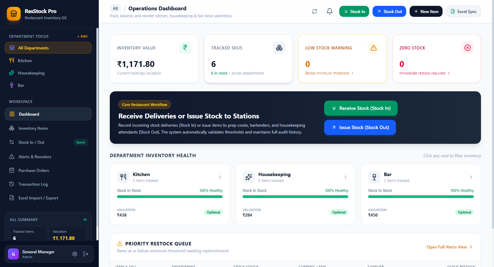

# ResStock Pro — Restaurant Stock Management System

A modern, responsive, and clean Stock Management Web Application for restaurants, tracking inventory across three core departments: **Kitchen**, **Housekeeping**, and **Bar**.

Built with **React 19**, **Tailwind CSS**, **Lucide Icons**, **Node.js / Express**, **better-sqlite3**, and **SheetJS (xlsx)**.

---

## 📸 Dashboard Preview



---

## 🌟 Key Features

### 1. 🔐 Role-Based Authentication & Session Persistence
- Secure Username and Password login with JWT token persistence (`localStorage`).
- Pre-seeded restaurant staff accounts with quick 1-click login buttons:
  - **General Manager (Alex Vance)**: `admin` / `admin123` (Access across All Departments)
  - **Executive Chef (Marco Rossi)**: `chef_marco` / `kitchen123` (Kitchen Focus)
  - **Head Mixologist (Sarah Jenkins)**: `bar_sarah` / `bar123` (Bar Focus)
  - **Operations & Housekeeping Lead (Elena Rostova)**: `hk_elena` / `housekeeping123` (Housekeeping Focus)

### 2. 🏢 Three-Department Inventory Tracking
- **Kitchen**: Steaks, seafood, dairy, olive oils, produce, dry goods, frozen inventory.
- **Housekeeping**: Sanitizers, industrial bleach, microfiber towels, trash liners, dishwasher pods, linens.
- **Bar**: Premium spirits, craft draft kegs, red & white wines, prosecco, tonic mixers, garnishes, bitters.
- Fast switching between **Kitchen**, **Housekeeping**, **Bar**, and **All Departments**.
- Live Department Health indicators (% healthy, item counts, valuation, and alerts).

### 3. 📦 Master Inventory Management Table
- Comprehensive item details: Item Name, SKU Code, Department, Category, Current Stock, Unit of Measure, Minimum Par Threshold, Unit Cost ($), Storage Location, and Distributor.
- Real-time **Search**, multi-column **Sorting** (Name, SKU, Stock Level, Value), and **Filtering** by Department, Category, and Stock Status.
- **Quick Inline Tally (+ / -)** buttons right inside each table row for rapid physical stock counts on tablets!
- Actions to Add, Edit, or Delete individual items.

### 4. 🔄 Stock In & Stock Out Workstation (The Core Workflow)
- **Order / Receive Stock (Stock In)**:
  - Select item, enter quantity received, input supplier / PO number and notes.
  - Automatically updates active stock and generates an audit log entry.
- **Issue Stock (Stock Out)**:
  - Select item, enter quantity issued to station (e.g. "Prep Line", "Patio Bar", "Guest Rooms").
  - Automatically deducts from inventory while preventing negative stockouts.
- **Live Movement Feed**: Real-time stream of incoming deliveries and issued supplies.

### 5. ⚠️ Visual Alerts & Reorder Center
- **Low Inventory Warning**: Highlighted in amber/orange with "Low Stock" badge when stock ≤ Minimum Par Threshold.
- **Zero Inventory Alert**: Highlighted in red with "Out of Stock" badge when stock = 0.
- **Automatic Reorder Calculator**: Suggests replenishment quantity (`2 × min_threshold - current_stock`) and estimated purchase order cost.
- **1-Click Quick Restock**: Pre-fills the Stock In modal directly from the alert row.
- **Alert Notification Bell**: Sticky dropdown on header with real-time badge count.

### 6. 📊 Transaction Audit Log
- Complete historical record tracking: Date/Time, Item Name, SKU, Department, Type (In, Out, Adjustment, Initial Import), Quantity (+ / -), Previous Stock → New Stock, Staff Member, Destination/Supplier, and Notes.
- Searchable and filterable by department and movement type.
- **Export Audit Sheet** button to download historical logs to Excel (`.xlsx`).

### 7. 📥 Excel & CSV Bulk Sync (SheetJS)
- **Upload Excel (`.xlsx` or `.csv`)**: Bulk-insert new items or bulk-update existing item counts and par thresholds automatically.
- **Sample Template Download**: 1-click in-app download of `sample_inventory_template.xlsx` pre-loaded with realistic restaurant items.
- **Drag & Drop Upload**: Instant parsing, 5-row table preview, and clear summary report (items created vs updated).
- **Export Inventory**: Download filtered department inventory to `.xlsx` with one click.

---

## 🚀 Quick Start Instructions

### Prerequisites
- Node.js (v18+)
- npm (v9+)

### Installation
```bash
# In the root directory:
npm install
cd client && npm install && cd ..
```

### Running the Application
To run both the Express backend and Vite React development server concurrently:
```bash
npm run dev
```
- **Backend API**: `http://localhost:5000`
- **Frontend App**: `http://localhost:5173` (proxies `/api` to port 5000)

### Production Deployment & Standalone Run

#### 1. Configure Production Environment (`.env`)
Copy the provided `.env.example` to `.env` and configure your custom admin username, password, and security secrets:

```bash
cp .env.example .env
```

Open `.env` and specify your credentials:
```env
# Application Environment
NODE_ENV=production
PORT=5000

# Security: Set a strong random secret key
JWT_SECRET=your_production_secret_key_change_this

# Production Administrator Login Credentials
ADMIN_USERNAME=your_admin_username
ADMIN_PASSWORD=your_strong_admin_password
ADMIN_NAME=General Manager

# Disable demo items & quick-login buttons
SEED_DEMO_DATA=false
ENABLE_DEMO_LOGINS=false

# Default Currency (e.g. ₹, $, €, £, AED)
DEFAULT_CURRENCY=₹
```

#### 2. Initialize Clean Production Database (Optional)
To wipe the sample/demo items and initialize a clean database with your configured admin credentials:
```bash
npm run clean-db
```
*(Or use `npm run sample-db` anytime if you want to restore the pre-populated demo items and accounts).*

#### 3. Build & Launch Production Server
```bash
npm run build
npm start
```
The server will run on `http://localhost:5000` (or your configured `PORT`), serving both the production REST API and the compiled React application.

---

## ⚙️ Environment Variables Reference

| Variable | Default | Description |
| :--- | :--- | :--- |
| `ADMIN_USERNAME` | `admin` | Username for the primary administrator account in production. |
| `ADMIN_PASSWORD` | `adminpassword` (prod) / `admin123` (dev) | Secure login password for the administrator account. Automatically synced on startup. |
| `ADMIN_NAME` | `Restaurant General Manager` | Display name of the administrator shown on reports and order signatures. |
| `NODE_ENV` | `development` | Setting to `production` disables sample data and hides quick-login helper buttons. |
| `PORT` | `5000` | Port number for Express server. |
| `JWT_SECRET` | `restaurant-stock-secret-key-2026` | Secret cryptographic key for signing JSON Web Tokens. |
| `SEED_DEMO_DATA` | `false` in prod / `true` in dev | If `false`, prevents pre-populating sample food/bar/cleaning items on clean installs. |
| `ENABLE_DEMO_LOGINS` | `false` in prod / `true` in dev | If `false`, hides the 1-click demo login cards on the login page. |
| `DEFAULT_CURRENCY` | `₹` | Default monetary currency symbol (configurable via Admin Settings UI as well). |

---

## 🗄️ Database Architecture (`server/inventory.db`)
- **`users`**: User credentials (bcrypt hashed), full names, staff roles, assigned department.
- **`items`**: Item name, SKU, department (`Kitchen`, `Housekeeping`, `Bar`), category, current stock, unit, min threshold, unit cost, supplier, location, notes.
- **`transactions`**: Audit trail with `item_id`, `type` (`IN`, `OUT`, `ADJUSTMENT`, `INITIAL`), `quantity`, `previous_stock`, `new_stock`, `user_name`, destination/source, and timestamp.
